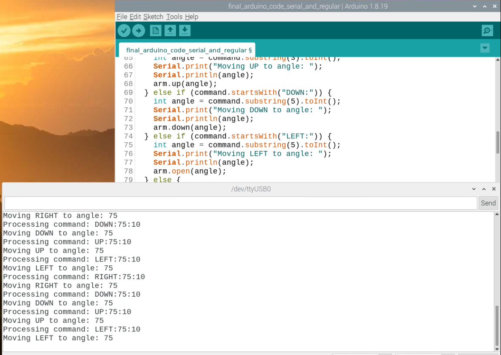

# 3 Joint Robotic Arm

Replace this text with a brief description (2-3 sentences) of your project. This description should draw the reader in and make them interested in what you've built. You can include what the biggest challenges, takeaways, and triumphs from completing the project were. As you complete your portfolio, remember your audience is less familiar than you are with all that your project entails!

You should comment out all portions of your portfolio that you have not completed yet, as well as any instructions:
```HTML 
<!--- This is an HTML comment in Markdown -->
<!--- Anything between these symbols will not render on the published site -->
```

| **Engineer** | **School** | **Area of Interest** | **Grade** |
|:--:|:--:|:--:|:--:|
| Siddhant N | Mission San Jose High school | Mechanical Engineering | Incoming Senior

**Replace the BlueStamp logo below with an image of yourself and your completed project. Follow the guide [here](https://tomcam.github.io/least-github-pages/adding-images-github-pages-site.html) if you need help.**


  
# Final Milestone
In my second milestone, I said I was going to get the arm to do certain tasks like identifying a specific object and then commanding it to pick it up. For my third and final milestone, I have come close to that goal. So far, the robotic arm is now fully functioning; the robot can identify objects using the Pi camera and the Coco library which is a pre-trained model. For this task, I have set up the code so that when the camera identifies a target object, it triggers a set of commands which the Raspberry Pi sends over to the Arduino Nano using serial communication. The code instructs the arm to pick up the object and drop it in another location. In my milestone video, the trigger is a person or my arm. So when I wave my hand across the camera the object recognition software recognizes it as a person which then triggers the set of commands.

**Don't forget to replace the text below with the embedding for your milestone video. Go to Youtube, click Share -> Embed, and copy and paste the code to replace what's below.**

<iframe width="560" height="315" src="https://www.youtube.com/embed/F7M7imOVGug" title="YouTube video player" frameborder="0" allow="accelerometer; autoplay; clipboard-write; encrypted-media; gyroscope; picture-in-picture; web-share" allowfullscreen></iframe>

## Challenges
- Batteries were not reliable or safe. The servos weren't functioning properly because they weren't receiving enough power and one of the batteries exploded while not even being plugged in so with the help of the instructors, I was able to switch to a power supply that plugged into the wall.
- Setting up the code for object recognition and serial communication. To be able to trigger a set of commands on an Arduino based on results from a Pi camera, I had to write a Python code that implemented object recognition and serial communication. It was a struggle because no matter what I did, the code would not use the results of the object recognition. To fix this I used the help of Chat GPT. GPT was able to point out my mistakes and suggested changes that started using the results of the Object recognition effectively which finally started to trigger the commands.
- Getting the Arduino to process the incoming commands. When the Pi first sent the commands, I wasn't sure if the Arduino was receiving the commands, but after looking at the serial monitor after some and the blinking rx light on the Nano, I was able to verify that the Arduino was receiving the commands.
  
  The next step was to see if the Arduino understood the commands and to my surprise, the Arduino did not because I did not identify the servos correctly in the processcommand code. I had each servo labelled as a specific movement, for example, servo 1 was arm.right and servo 2 was arm.up. To fix this, I again used the help of GPT which suggested looking through the source file that the code relies on(specifically the Cokoinoarm.h file). In that file I was able to find the appropriate wording needed to classify each servo which was arm.servo1, arm.servo2 and so on. With this change, the Arduino was finally able to run through and understand the commands as you can in the video.
- The Pi camera cable was too short. For the arm to recognize objects that are in its field of view, I planned on attaching the camera to the arm right below the claw. The camera ribbon cable was too short for the arm to rotate around freely. To fix this, I replaced the short cable with a much longer ribbon cable which was much easier to work around. 

## Reflection & Future improvements
This project has taught me to look at problems through multiple perspectives for the best solution for example when I was having trouble with. This was also my first time working with a Raspberry Pi or any form of coding in a project. While it was a struggle I am starting to get a hang of it. The project also helped me learn code in project-based learning which resonates with me a lot more than other forms of learning like the online bootcamps. The project has also allowed me to utilize my previous skills from the first tech challenge(FTC) and form new skills like implementing code into mechanical projects which I can use in the future to make projects that are focused on both aspects equally compared to my past projects being purely mechanical. Speaking of future projects, I plan on continuing this robot arm as well because there are some modifications I want to add to the arm and I never really got to complete my original modifications. After I finish my original modification, one of the new modifications I am considering is giving the arm the ability to be able to take speech commands so it can be controlled by voice and specifically be instructed to pick up one item over the other.


# Second Milestone

**Don't forget to replace the text below with the embedding for your milestone video. Go to Youtube, click Share -> Embed, and copy and paste the code to replace what's below.**

<iframe width="560" height="560" src="https://www.youtube.com/embed/00VdxgJGQjs" title="Siddhant N. Second Milestone" frameborder="0" allow="accelerometer; autoplay; clipboard-write; encrypted-media; gyroscope; picture-in-picture; web-share" referrerpolicy="strict-origin-when-cross-origin" allowfullscreen></iframe>


For my second milestone, I implemented a Raspberry Pi and a Pi camera into my project. I added the Pi and the Pi camera so that the claw can have the ability to identify specific objects and pick up specific items. So far I have established the serial communication between the Arduino Nano and the Raspberry Pi. I have also been able to get the Pi camera and object recognition working using the coco library to be able to identify a few different items.


## Challenges
- Struggling to get the Arduino IDE to work on the raspberry pi. To solve the issue, I did some research, and with the help of my instructor Katie, I figured out that I had the wrong version of the IDE. I had the linux 32arm and instantly switched to the Linux 64arm.
- Downloading the open CV for object detection. I was not able to download the libjasper package required for object detection because it wasn't recognized or wasn't available on the latest OS of the Raspberry Pi (bullseye). To fix this, I flashed my micro SD to an older buster, specifically the one released in May of 2021. This seemed to fix my problem I was able to get object detection working.
- Editing the code for the object recognition. The tutorial I was using for the object recognition came with a code file that had the script for the object recognition. Unfortunatley that code file didn't work for me so I had to change up the code and the path the code was taking to use the coco library.

## Steps towards final milestone
- To bring this robot together, I plan on integrating the Raspberry Pi and the camera into the arm so that they can work together to complete certain tasks like recognizing and picking up a specific object when instructed.
- I may also add a rubber sleeve to the claws to be able to grip items better
  

# First Milestone

**Don't forget to replace the text below with the embedding for your milestone video. Go to Youtube, click Share -> Embed, and copy and paste the code to replace what's below.**

<iframe width="560" height="560" src="https://www.youtube.com/embed/9bqB15PK2Zs?list=PLe-u_DjFx7eticgHvdNBMS-CTTohSGwUM" title="Siddhant N  First Milestone" frameborder="0" allow="accelerometer; autoplay; clipboard-write; encrypted-media; gyroscope; picture-in-picture; web-share" referrerpolicy="strict-origin-when-cross-origin" allowfullscreen></iframe>
  
- The project I have chosen is the 3 joint robot arm which uses a total of 4 servos. The arm can pick up and drop small lightweight objects. The arm can move objects from one place to another using the servo which rotates the bottom platform with the help of a large bearing- So far I have made the base model of the robotic arm which is controlled using two joysticks connected to an Arduino Nano that instructs the servos on the arm as per the input from the joysticks.	 
## Challenges
- The flimsy base piece broke and was later replaced.
- One of the servos stopped functioning because it was burnt out 
- The big bearing for the platform was too rough for the small MG90s servo to push around. I fixed this issue by using basic bicycle chain lubricant which worked perfectly and made the bearing smooth enough for the servo to move the arm around.
## Further improvements
- For the claw to pick up a variety of differently shaped items, I plan on adding another servo to the arm that rotates the claw so it can better position itself to pick up different items.
- I also plan on connecting a Rasberry Pi and a Pi camera to the robot arm for color and object detection so the arm can recognize objects around it and hopefully be commanded to pick up specific objects.
  
# Schematics 
Here's where you'll put images of your schematics. [Tinkercad](https://www.tinkercad.com/blog/official-guide-to-tinkercad-circuits) and [Fritzing](https://fritzing.org/learning/) are both great resoruces to create professional schematic diagrams, though BSE recommends Tinkercad becuase it can be done easily and for free in the browser. 

# Code
Here's where you'll put your code. The syntax below places it into a block of code. Follow the guide [here]([url](https://www.markdownguide.org/extended-syntax/)) to learn how to customize it to your project needs. 

```c++
void setup() {
  // put your setup code here, to run once:
  Serial.begin(9600);
  Serial.println("Hello World!");
}

void loop() {
  // put your main code here, to run repeatedly:

}
```

# Bill of Materials
Here's where you'll list the parts in your project. To add more rows, just copy and paste the example rows below.
Don't forget to place the link of where to buy each component inside the quotation marks in the corresponding row after href =. Follow the guide [here]([url](https://www.markdownguide.org/extended-syntax/)) to learn how to customize this to your project needs. 

| **Part** | **Note** | **Price** | **Link** |
|:--:|:--:|:--:|:--:|
| 3 Joint Robotic Arm| Used as the base model for the robotic arm | $50 | <a href="https://www.amazon.com/LK-COKOINO-Compliment-Engineering-Technology/dp/B081FG1JQ1"> Link </a> |
| Servo Shield | Replace orginal shield to use 9v batteries | $10.99 | <a href="https://a.co/d/gEROH1a"> Link </a> |
| 9V batteries | Used to power the robotic arm | $8.99 | <a href="https://a.co/d/fZLAYWA"> Link </a> |
| Screwdriver Kit | Used to assemble the robotic arm | $7.99 | <a href="https://www.amazon.com/Small-Screwdriver-Set-Mini-Magnetic/dp/B08RYXKJW9/"> Link </a> |
| Raspberry Pi 4B | Used connect the pi camera to the arm and for object recognition | $105 | <a href="https://a.co/d/0bOvawIx"> Link </a> |
| Pi camera | used for object recognition | $10 | <a href="https://a.co/d/0j8dtRFs"> Link </a> |
| 9V Barrel Jack | Used to connect the 9V battery to the servo shield | $5.99 | <a href="https://a.co/d/hVp96Vq"> Link </a> |
| 9V Barrel Jack | Used to connect the 9V battery to the servo shield | $5.99 | <a href="https://a.co/d/hVp96Vq"> Link </a> |


# Other Resources/Examples
One of the best parts about Github is that you can view how other people set up their own work. Here are some past BSE portfolios that are awesome examples. You can view how they set up their portfolio, and you can view their index.md files to understand how they implemented different portfolio components.
- [Example 1](https://trashytuber.github.io/YimingJiaBlueStamp/)
- [Example 2](https://sviatil0.github.io/Sviatoslav_BSE/)
- [Example 3](https://arneshkumar.github.io/arneshbluestamp/)

To watch the BSE tutorial on how to create a portfolio, click here.
